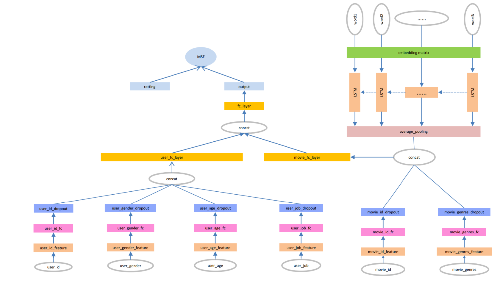

# Rating Prediction using Deep Learning on the MovieLens 1M Dataset

## MovieLen 1M Data and Introduction
The MovieLens 1M dataset contains one million ratings from 6,000 users on nearly 4,000 movies, and also includes movie metadata information and user attribute information. The download address is：   
[http://files.grouplens.org/datasets/movielens/ml-1m.zip](http://files.grouplens.org/datasets/movielens/ml-1m.zip)   
The dataset is divided into three files: movie metadata information (movie.dat), user attribute information (users.dat), and user rating data (ratings.dat).。

### Movie Metadata
The format of movie metadata is：MovieID::Title::Genres。
- Title：Movie title (including release year)
- Genres：Multiple movie genres are separated by "|", and there are the following 18 types of genres:
	* Action
	* Adventure
	* Animation
	* Children's
	* Comedy
	* Crime
	* Documentary
	* Drama
	* Fantasy
	* Film-Noir
	* Horror
	* Musical
	* Mystery
	* Romance
	* Sci-Fi
	* Thriller
	* War
	* Western
- MovieID：
### User Attribute Information
The format of user attribute information is:：UserID::Gender::Age::Occupation::Zip-code。

- Gender："M" represents male, and "F" represents female
- Age:The age values are as follows：
	*  1:  “Under 18 years old”
	* 18:  "18-24"
	* 25:  "25-34"
	* 35:  "35-44"
	* 45:  "45-49"
	* 50:  "50-55"
	* 56:  "56+"
- Occupation：
	*  0:  "other" or not specified
	*  1:  "academic/educator"
	*  2:  "artist"
	*  3:  "clerical/admin"
	*  4:  "college/grad student"
	*  5:  "customer service"
	*  6:  "doctor/health care"
	*  7:  "executive/managerial"
	*  8:  "farmer"
	*  9:  "homemaker"
	* 10:  "K-12 student"
	* 11:  "lawyer"
	* 12:  "programmer"
	* 13:  "retired"
	* 14:  "sales/marketing"
	* 15:  "scientist"
	* 16:  "self-employed"
	* 17:  "technician/engineer"
	* 18:  "tradesman/craftsman"
	* 19:  "unemployed"
	* 20:  "writer"
### Movie Ratings
The format of movie ratings is：UserID::MovieID::Rating::Timestamp   
- UserID: [1-6040]  
- MovieIDs:[1-3952]  
- Ratings:1-5 
- Timestamp
- Each user has at least 20 ratings 

## Data Preprocessing and Network Model Design
- Conduct preliminary processing on the data in the dataset, save the user data and movie data separately, and split the data into training and test sets;
- Build a neural network model. First, build user feature networks and movie feature networks respectively. Use embedding layers to handle discrete features, then use fully connected layers for feature transformation and extraction, and perform Dropout regularization. Among them, the movie_title uses the LSTM model to process the sequence information of movie titles, learn the relationship of word context, and use the average pooling method to exclude the influence of zero padding and title length on features. Then, integrate the user feature network and the movie feature network, learn the interaction relationship through fully connected layers and the Relu activation function. Finally, pass the integrated user-movie feature network through a fully connected layer with only one neuron to output the rating prediction value.
- 
### Introduction to Model Python Files and Their Sequence
- pre_process.py:Data download, decompression, preliminary processing, and saving 
- fuke_dataset.py:Data loading and management, providing batched data for the model.
- fuke_inference.py:Neural network model.  
- fuke_train.py:Model training. 
- fuke_test.py:Model testing.	
- fuke_features.py:Feature extraction.
- fuke_predicted.py:Model prediction. 

### Data Preprocessing
In the MovieLens dataset, UserID, Gender, Age, Job in the user features and MovieID in the movie features can all be considered as categorical data, and One-Hot encoding is usually used. However, there are many types of values for MovieID and UserID. If One-Hot encoding is used, each value will be encoded into a very high-dimensional sparse vector, which requires a large amount of computation as an input to the neural network. In addition, with One-Hot encoding, the distances between different attribute values are all equal. For example, the squared distances between "less than 18 years old", "35-44", "56+", and "25-44" are all 2. Therefore, in the data preprocessing stage, we do not use One-Hot encoding but simply encode these data into numbers and use these data as indices of the embedding matrix. The first layer of the neural network uses an embedding layer, and the embedding matrix is obtained through learning.

Movie genres and movie titles are special, and they can be regarded as multi-valued attributes with different lengths. For movie genres, since there are not many types, Multi-Hot encoding can be used directly. In the neural network, inputs of different lengths are realized by multiplying the encoded vectors with the embedding matrix. The processing of movie titles is a bit more complicated. First, a mapping dictionary from word to int is created, then the titles are encoded using a list of numbers and padded to the same length, and then they pass through an LSTM network, and the mean value of all outputs of the network is calculated (average pooling) to obtain the movie title features.

- UserID、Occupation、MovieID remain unchanged.
- Gender: 'F' and 'M' need to be converted to 0 and 1.
- Age：Converted into 7 consecutive numbers from 0 to 6.
- Genres：Multi-valued attribute, using Multi-Hot encoding with a dimension of 18.
- Title：A mapping dictionary from word to int is created, then encoded using a list of numbers and padded to the same length, with a dimension of 15.

The complete code for data preprocessing can be found in[pre_process.py](pre_process.py)

#### Multi-Hot Encoding Function for Movie Genres
```
def genres_multi_hot(genre_int_map):
    def helper(genres):
        genre_int_list = [genre_int_map[genre] for genre in genres.split('|')]
        multi_hot = np.zeros(len(genre_int_map))
        multi_hot[genre_int_list] = 1
        return multi_hot
    return helper
```

#### Movie Digital List Encoding Function
```python
def title_encode(word_int_map):
    def helper(title):
        title_words = [word_int_map[word] for word in title.split()]
        if len(title_words) > 15:
            return np.array(title[:15])
        else:
            title_vector = np.zeros(15)
            title_vector[:len(title_words)] = title_words
            return title_vector

    return helper
```
#### Data Preprocessing Function
```python
def load_data(dataset_zip):
    with zipfile.ZipFile(dataset_zip) as zf:
        #Reading users data and data preprocessing
        with zf.open('ml-1m/users.dat') as users_raw_data:
            users_title = ['UserID','Gender','Age','JobID','Zip-code']
            users_raw_data = users_raw_data.read().decode('ISO-8859-1')
            users_raw_data = StringIO(users_raw_data)
            users = pd.read_table(users_raw_data,sep='::',header=None,names=users_title,engine='python')
            users = users.filter(regex='UserID|Gender|Age|JobID')

            gender_map = {'F':0 , 'M':1}
            users['GenderIndex'] = users['Gender'].map(gender_map)
            age_map = {var:ii for ii,var in enumerate(set(users['Age']))}
            users['AgeIndex'] = users['Age'].map(age_map)

        #Reading movies data and data preprocessing
        with zf.open('ml-1m/movies.dat') as movies_raw_data:
            movies_title = ['MovieID','Title','Genres']
            movies_raw_data = movies_raw_data.read().decode('ISO-8859-1')
            movies_raw_data = StringIO(movies_raw_data)
            movies = pd.read_table(movies_raw_data,sep='::',header=None,names=movies_title,engine='python')

            #Separate the movie name from the year in the title
            pattern = re.compile('^(.*)\((\d+)\)')
            movies['TitleWithoutYear'] = movies['Title'].map(lambda x: pattern.match(x).group(1))#获得不含年份的电影名称

            genre_set = set()
            for var in movies['Genres'].str.split('|'):
                genre_set.update(var)
            genre_int_map = {var:ii for ii,var in enumerate(genre_set)}
            movies['GenresMultiHot'] = movies['Genres'].map(genres_multi_hot(genre_int_map))

            word_set = set()
            for var in movies['TitleWithoutYear'].str.split():
                word_set.update(var)
            word_int_map = {var:ii for ii,var in enumerate(word_set,start=1)}
            movies['TitleIndex'] = movies['TitleWithoutYear'].map(title_encode(word_int_map))
            title_indices = list(word_int_map.values())
            title_word_count = len(set(title_indices))

        #Reading ratings data and data preprocessing
        with zf.open('ml-1m/ratings.dat') as ratings_raw_data:
            ratings_title = ['UserID','MovieID','ratings','Timestamp']
            ratings = pd.read_table(ratings_raw_data,sep='::',header=None,names=ratings_title,engine='python')
            ratings = ratings.filter(regex='UserID|MovieID|ratings')

        #Merge three tables
        data = pd.merge(pd.merge(users,ratings),movies)
        #features,targets tables
        features,targets = data.drop(['ratings'],axis=1),data[['ratings']]
        return features,targets,age_map,gender_map,genre_int_map,word_int_map,users,movies
```
### Model Design

The network model used in this paper is shown in the figure above. The network can be divided into two major parts, namely the user feature network and the movie feature network. These two sub-networks eventually output a 200-dimensional vector through a fully connected layer, which serves as the user features and movie features.
After obtaining the user feature vector and the movie feature vector, the rating can be fitted in various ways. In this paper, the two inputs are passed through a fully connected layer with only one neuron, and the output is taken as the rating, and the MSE is used as the loss function to optimize the network.

#### User Feature Network
The processing methods for UserID, Age, Gender, and Job are the same. First, the corresponding feature vectors are retrieved from the embedding matrix using the input as the index. Among them, UserID is encoded as a 32-dimensional vector, and the other features are encoded as 16-dimensional vectors. Then, a fully connected layer and a dropout layer are added respectively. The number of neurons in the fully connected layer is 32. Finally, the four obtained 32-dimensional vectors are concatenated together to form a 128-dimensional vector, which serves as the input of the fully connected layer, and finally a 200-dimensional user feature vector is output.

#### Core Code of the User Feature Network
```python
def user_feature_network(user_id,user_gender,user_age,user_job,dropout_rate):

    dropout_rate = DROPOUT_RATE

    #users embed layer
    user_id_embed_layer = Embedding(USER_ID_COUNT,EMBED_DIM,name='user_id_embed')(user_id)
    user_id_embed_layer = Reshape((EMBED_DIM,))(user_id_embed_layer)

    user_gender_embed_layer = Embedding(GENDER_COUNT, EMBED_DIM // 2, name='user_gender_embed')(user_gender)
    user_gender_embed_layer = Reshape((EMBED_DIM // 2,))(user_gender_embed_layer)

    user_age_embed_layer = Embedding(AGE_COUNT,EMBED_DIM // 2,name='user_age_embed')(user_age)
    user_age_embed_layer = Reshape((EMBED_DIM // 2,))(user_age_embed_layer)

    user_job_embed_layer = Embedding(JOB_COUNT, EMBED_DIM // 2, name='user_job_embed')(user_job)
    user_job_embed_layer = Reshape((EMBED_DIM // 2,))(user_job_embed_layer)


    #users fully Connected Layer+dropout

    user_id_fc_layer = Dense(EMBED_DIM,activation='relu',name='user_id_fc')(user_id_embed_layer)
    user_id_fc_layer = Dropout(dropout_rate,name='user_id_dropout')(user_id_fc_layer)

    user_gender_fc_layer = Dense(EMBED_DIM, activation='relu', name='user_gender_fc')(user_gender_embed_layer)
    user_gender_fc_layer = Dropout(dropout_rate, name='user_gender_dropout')(user_gender_fc_layer)

    user_age_fc_layer = Dense(EMBED_DIM, activation='relu', name='user_age_fc')(user_age_embed_layer)
    user_age_fc_layer = Dropout(dropout_rate, name='user_age_dropout')(user_age_fc_layer)

    user_job_fc_layer = Dense(EMBED_DIM, activation='relu', name='user_job_fc')(user_job_embed_layer)
    user_job_fc_layer = Dropout(dropout_rate, name='user_job_dropout')(user_job_fc_layer)

    #user_combine_feature
    user_combine_feature = Concatenate(axis=1,name='user_combine_feature')([user_id_fc_layer,
                                                                            user_gender_fc_layer,
                                                                            user_age_fc_layer,
                                                                            user_job_fc_layer])
    user_combine_fc_layer = Dense(200,activation='relu',name='user_combine_fc_layer')(user_combine_feature)

    return user_combine_fc_layer
```

#### Movie Feature Network
The processing methods for MovieID and Genres are the same as those for user features.

After passing through the embedding layer, the Title is encoded into a three-dimensional dense matrix of [n, 15, 32]. The number 15 reflects the relationship of time steps, and 32 indicates that each word of the movie title is represented by a 32-dimensional feature vector. Then, it passes through an LSTM with a hidden layer of 128 neurons. After that, the average value of the outputs of these 15 LSTM units is calculated and divided by the length of the movie title (to eliminate the influence of zero padding and title length on the features), and finally, a 128-dimensional feature vector is obtained.This vector is concatenated with the output vectors of MovieID and Genres as the input of the fully connected layer, and finally, a 200-dimensional vector is obtained as the movie feature vector.

It should be noted that although the title length after padding in the preprocessing stage is all 15, when actually calculating, the Keras LSTM layer is used to learn the context-based information of the movie title, and average pooling and normalization by the actual sequence length are performed to eliminate the influence of zero padding and the influence of title length on the features.
。
#### Core Code of the Movie Feature Network
```python
def movie_feature_network(movie_id,movie_genres,movie_titles,movie_title_length,dropout_rate):

    dropout_rate = DROPOUT_RATE

    #movie_id
    movie_id_embed_layer = Embedding(MOVIE_ID_COUNT,EMBED_DIM,name='movie_id_embed_1')(movie_id)
    movie_id_embed_layer = Reshape((EMBED_DIM,))(movie_id_embed_layer)
    movie_id_embed_layer = Dense(EMBED_DIM, activation='relu', name='movie_id_embed_2')(movie_id_embed_layer)
    movie_id_embed_layer = Dropout(dropout_rate,name='movie_id_embed')(movie_id_embed_layer)

    #movie_genres
    movie_genres_embed_layer = Dense(EMBED_DIM,use_bias=False,activation='relu',name='movie_genres_embed_layer1')(movie_genres)
    movie_genres_embed_layer = Dropout(dropout_rate,name='movie_genres_embed_layer')(movie_genres_embed_layer)


    #movie_titles
    embedding_layer = Embedding(input_dim=MOVIE_TITLE_WORDS_COUNT, output_dim=EMBED_DIM, name="movie_embedding")
    movie_title_embed_layer = embedding_layer(movie_titles)
    lstm_layer = tf.keras.layers.LSTM(
        LSTM_UNIT_NUM,  # LSTM单元数
        return_sequences=True,  # 如果需要输出所有时间步的输出
        return_state=True,  # 如果需要返回最终的状态（h和c）
        dropout=dropout_rate,  # 使用的dropout率
        recurrent_dropout=dropout_rate  # 对递归连接的dropout率
    )

    lstm_output, state_h, state_c = lstm_layer(movie_title_embed_layer)
    lstm_output_pooled = GlobalAveragePooling1D()(lstm_output)
    movie_title_length_expanded = Dense(LSTM_UNIT_NUM,use_bias=False,activation=None)(movie_title_length)
    lstm_output = Multiply()([lstm_output_pooled,1.0/movie_title_length_expanded])

    #movie_combine_feature
    movie_combine_feature = Concatenate(axis=1,name='movie_combine_feature')([movie_id_embed_layer,
                                                                              movie_genres_embed_layer,
                                                                              lstm_output])
    movie_combine_layer = Dense(200,activation='relu',name='movie_fc_layer')(movie_combine_feature)

    return movie_combine_layer
```
#### Core Code of the Loss Layer
```python
def full_network(user_input,movie_input,dropout_rate):

    dropout_rate = DROPOUT_RATE

    user_combine_fc_layer = user_feature_network(*user_input,dropout_rate)
    movie_combine_layer = movie_feature_network(*movie_input,dropout_rate)

    #Merge user and movie features
    input_layer = Concatenate(axis=1, name='user_movie_fc')([user_combine_fc_layer,
                                                             movie_combine_layer])

    predicted = Dense(1, name='prediction')(input_layer)

    return user_combine_fc_layer,movie_combine_layer,predicted
```

## Model Training
The dataset is randomly divided into a training set and a test set at a ratio of 0.8 to 0.2. The training set is further randomly divided into a training subset and a validation set at a ratio of 0.8 to 0.2. Validation is performed on the validation set every 1,500 batches, and the model is saved only when the validation loss is lower than the recorded loss. The position of model training is recorded to facilitate continued training from the previous training basis in the next training. A learning rate scheduler is set in the model so that the learning rate can gradually decay as the number of training batches increases, enabling the model to converge rapidly at the beginning and then learn more subtle feature changes through learning rate decay.

## Experimental Results
The dataset is randomly divided into a training set and a test set at a ratio of 0.8 to 0.2. The final model is obtained after 5 epochs of training, and the test result on the test set shows that the MSE is around 0.84.
The following is the result of a certain run.
```
2024-12-02 17:50:03,892 - INFO - Batch  773/782   test_loss = 0.878
2024-12-02 17:50:03,954 - INFO - Batch  774/782   test_loss = 0.856
2024-12-02 17:50:04,021 - INFO - Batch  775/782   test_loss = 0.792
2024-12-02 17:50:04,069 - INFO - Batch  776/782   test_loss = 0.794
2024-12-02 17:50:04,150 - INFO - Batch  777/782   test_loss = 0.756
2024-12-02 17:50:04,201 - INFO - Batch  778/782   test_loss = 0.861
2024-12-02 17:50:04,239 - INFO - Batch  779/782   test_loss = 0.753
2024-12-02 17:50:04,282 - INFO - Batch  780/782   test_loss = 0.970
2024-12-02 17:50:04,304 - INFO - Batch  781/782   test_loss = 1.117
2024-12-02 17:50:04,304 - INFO - 模型测试的MSE损失值是0.883
```
## Feature Extraction and Rating Prediction
Since both user attribute information and movie metadata information are static data, user features and movie features can be calculated offline after the model is trained, and then stored for use in rating prediction and recommendation.

### 特征提取核心代码
```python
def extract_trained_features(user_data, movie_data,target, model_path):
    # Load the trained model
    model = tf.keras.models.load_model(model_path)

    user_combined_feature_output = tf.keras.Model(inputs=model.input, outputs=model.get_layer('user_combine_fc_layer').output)
    movie_combine_feature_output = tf.keras.Model(inputs=model.input,outputs=model.get_layer('movie_fc_layer').output)

    user_movie_fc_output = tf.keras.Model(inputs=model.input,outputs=model.get_layer('prediction').output)

    user_id = user_data['user_id']
    user_gender = user_data['user_gender']
    user_age = user_data['user_age']
    user_job = user_data['user_job']

    movie_id = movie_data['movie_id']
    movie_genres = movie_data['movie_genres']
    movie_titles = movie_data['movie_titles']
    movie_title_length = movie_data['movie_title_length']

    combined_features = [user_id, user_gender, user_age, user_job, movie_id, movie_genres, movie_titles, movie_title_length, target]

    # Extract user and movie features
    user_features_1 = user_combined_feature_output.predict(combined_features)  
    movie_features_1 = movie_combine_feature_output.predict(combined_features) 

    user_features={}
    movie_features={}
    for idx,user_id_val in enumerate(user_id):
        user_features[user_id_val[0]] = user_features_1[idx]

    for idx,movie_id_val in enumerate(movie_id):
        movie_features[movie_id_val[0]] = movie_features_1[idx]

    #Extract kernel and bias
    weights = user_movie_fc_output.get_weights()
    #print(len(weights))
    kernel = weights[25]
    bias = weights[26]
    #print(len(weights))
    #for i, weight in enumerate(weights):
    #    print(f"Weight {i} shape: {weight.shape}")

    if os.path.exists('data/user_features.p'):
        print('The user_features file already exists and does not need to be saved')
    else:
        print("Saving user features...",)
        with open('data/user_features.p', 'wb') as uf:
            pickle.dump(user_features, uf)
            print("User features saved")

    if os.path.exists('data/movie_features.p'):
        print('The movie_features file already exists and does not need to be saved')
    else:
        print("Saving movie features...")
        with open('data/movie_features.p', 'wb') as mf:
            pickle.dump(movie_features, mf)
            print("Movie features saved.")

    if os.path.exists('data/user_movie_fc_param.p'):
        print('The weight and bias features already exist and do not need to be saved.')
    else:
        print("Saving weight and bias features....")
        with open('data/user_movie_fc_param.p','wb') as param:
            pickle.dump((kernel, bias), param)
            print("Weight and bias features saved.")


if __name__ == '__main__':
    with open('data/data.p','rb') as data:
        train_x,_,train_y,_ = pickle.load(data,encoding='utf-8')

user_data = {
    'user_id': np.reshape(np.array(train_x['UserID'], dtype=np.int32), (-1, 1)),
    'user_gender': np.reshape(np.array(train_x['GenderIndex'], dtype=np.int32), (-1, 1)),
    'user_age': np.reshape(np.array(train_x['AgeIndex'], dtype=np.int32), (-1, 1)),
    'user_job': np.reshape(np.array(train_x['JobID'], dtype=np.int32), (-1, 1))
}

movie_title_length = (np.array(list(train_x['TitleIndex']), dtype=np.int32)!= 0).sum(axis=1)
movie_data = {
    'movie_id': np.reshape(np.array(train_x['MovieID'], dtype=np.int32), (-1, 1)),
    'movie_genres': np.array(list(train_x['GenresMultiHot']), dtype=np.float32),
    'movie_titles': np.array(list(train_x['TitleIndex']), dtype=np.int32),
    'movie_title_length': np.reshape(movie_title_length ,(-1, 1))
}

target = np.reshape(np.array(train_y['ratings'], dtype=np.float32), (-1, 1))

extract_trained_features(user_data, movie_data,target, 'data/model/latest_model.keras')
```
### Rating and Similarity Calculation of Users and Movies
After storing features and parameters offline, ratings can be calculated directly without using Tensorflow to define a network. In addition to predicting ratings, the most similar users and movies can also be calculated through features.

```python
def relu(x):
    s = tf.maximum(x,0)
    return s

def predict_rating(user_feature,movie_feature,kernel,basis,activate):
    feature = np.concatenate((user_feature,movie_feature))
    xw_b = np.dot(feature,kernel) + basis
    output = activate(xw_b)
    return output

def cosine_similarity(vec_left,vec_right):
    num = np.dot(vec_left,vec_right)
    denom = np.linalg.norm(vec_left) * np.linalg.norm(vec_right)
    cos = -1 if denom == 0 else num / denom
    return cos

def similar_movie(movie_id,top_k,movie_features):
    cosine_similarities = {}
    movie_feature_i = movie_features[movie_id]
    for movie_id_,movie_feature_ in movie_features.items():
        if movie_id_ != movie_id:
            cosine_similarities[movie_id_] = cosine_similarity(movie_feature_i,movie_feature_)
    return sorted(cosine_similarities.items(),key=lambda item:item[1],reverse=True)[:top_k]

def similar_user(user_id,top_k,user_features):
    cosine_similarities = {}
    user_feature_i = user_features[user_id]
    for user_id_,user_feature_ in user_features.items():
        if user_id_ != user_id:
            cosine_similarities[user_id_] = cosine_similarity(user_feature_i,user_feature_)
    return sorted(cosine_similarities.items(),key=lambda item:item[1],reverse=True)[:top_k]

if __name__ == '__main__':
    with open('data/user_features.p','rb') as uf:
        user_features = pickle.load(uf,encoding='utf-8')

    with open('data/movie_features.p','rb') as mf:
        movie_features = pickle.load(mf,encoding='utf-8')

    with open('data/user_movie_fc_param.p','rb') as params:
        kernel,bias = pickle.load(params,encoding='utf-8')

    with open('data/users.p','rb') as usr:
        users = pickle.load(usr,encoding='utf-8')

    with open('data/movies.p','rb') as mv:
        movies = pickle.load(mv,encoding='utf-8')

    rating1 = predict_rating(user_features[12],movie_features[517],kernel,bias,relu)
    print('UserId={},MovieId={},Rating={:.3f}'.format(1,1193,rating1[0]))

    rating2 = predict_rating(user_features[521], movie_features[95], kernel, bias, relu)
    print('UserId={},MovieId={},Rating={:.3f}'.format(5900, 3100, rating2[0]))

    similar_users = similar_user(5900,5,user_features)
    print('这些用户与用户{}最相似'.format(str(users[users['UserID'] == 5900][['UserID','Gender','Age','JobID']].to_dict('records'))))
    for user in similar_users:
        print('最相似的用户{},相似度：{:.4f}'.format(users[users['UserID'] == user[0]][['UserID','Gender','Age','JobID']].to_dict('records')[0],user[1]))

    similar_movies = similar_movie(1401,5,movie_features)
    print('这些电影与电影{}最相似'.format(str(movies[movies['MovieID'] == 1401][['MovieID','Title','Genres']].to_dict('records'))))
    for movie in similar_movies:
        print('最相似的电影{}，相似度：{:.4f}'.format(movies[movies['MovieID'] == movie[0]][['MovieID', 'Title', 'Genres']].to_dict('records')[0],movie[1]))
```

output：

```
UserId=1,MovieId=1193,Rating=3.548
UserId=5900,MovieId=3100,Rating=3.555
这些用户与用户[{'UserID': 5900, 'Gender': 'M', 'Age': 25, 'JobID': 7}]最相似
最相似的用户{'UserID': 595, 'Gender': 'M', 'Age': 25, 'JobID': 7},相似度：0.9994
最相似的用户{'UserID': 26, 'Gender': 'M', 'Age': 25, 'JobID': 7},相似度：0.9991
最相似的用户{'UserID': 4487, 'Gender': 'M', 'Age': 25, 'JobID': 7},相似度：0.9990
最相似的用户{'UserID': 3973, 'Gender': 'M', 'Age': 25, 'JobID': 7},相似度：0.9990
最相似的用户{'UserID': 2809, 'Gender': 'M', 'Age': 25, 'JobID': 7},相似度：0.9990
这些电影与电影[{'MovieID': 1401, 'Title': 'Ghosts of Mississippi (1996)', 'Genres': 'Drama'}]最相似
最相似的电影{'MovieID': 2272, 'Title': 'One True Thing (1998)', 'Genres': 'Drama'}，相似度：0.9953
最相似的电影{'MovieID': 1302, 'Title': 'Field of Dreams (1989)', 'Genres': 'Drama'}，相似度：0.9947
最相似的电影{'MovieID': 2329, 'Title': 'American History X (1998)', 'Genres': 'Drama'}，相似度：0.9943
最相似的电影{'MovieID': 1957, 'Title': 'Chariots of Fire (1981)', 'Genres': 'Drama'}，相似度：0.9941
最相似的电影{'MovieID': 2420, 'Title': 'Karate Kid, The (1984)', 'Genres': 'Drama'}，相似度：0.9931
```

## Next Steps
1. Use more features to further reduce the MSE
    - The Zip-code in the user attribute data can identify the region where the user is located. People from different regions may have different preferences, and it should be a useful feature.
    - Time features: The release time in the movie title. Movies from different eras may have slightly different ratings; the time when a user rates a movie relative to the movie's release time may also affect the rating.
2. Use the obtained features for movie recommendations.